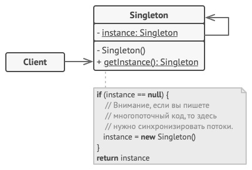

# Singleton

Одиночка — это порождающий паттерн проектирования, который гарантирует, что у класса есть только один экземпляр, и предоставляет к нему глобальную точку доступа.

## Какие проблемы решает

Одиночка решает сразу две проблемы, нарушая принцип единственной ответственности класса.

1. **Гарантирует наличие единственного экземпляра класса**. Чаще всего это полезно для доступа к какому-то общему ресурсу, например, базе данных.

   Представьте, что вы создали объект, а через некоторое время пробуете создать ещё один. В этом случае хотелось бы получить старый объект, вместо создания нового.

   Такое поведение невозможно реализовать с помощью обычного конструктора, так как конструктор класса всегда возвращает новый объект.

2. **Предоставляет глобальную точку доступа**. Это не просто глобальная переменная, через которую можно достучаться к определённому объекту. Глобальные переменные не защищены от записи, поэтому любой код может подменять их значения без вашего ведома.

    Но есть и другой нюанс. Неплохо бы хранить в одном месте и код, который решает проблему №1, а также иметь к нему простой и доступный интерфейс.

Интересно, что в наше время паттерн стал настолько известен, что теперь люди называют «одиночками» даже те классы, которые решают лишь одну из проблем, перечисленных выше.

## Реализация

Все реализации одиночки сводятся к тому, чтобы скрыть конструктор по умолчанию и создать публичный статический метод, который и будет контролировать жизненный цикл объекта-одиночки.

Если у вас есть доступ к классу одиночки, значит, будет доступ и к этому статическому методу. Из какой точки кода вы бы его ни вызвали, он всегда будет отдавать один и тот же объект.

## Структура

## Плюсы

- Гарантирует наличие единственного экземпляра класса.
- Предоставляет к нему глобальную точку доступа.
- Реализует отложенную инициализацию объекта-одиночки.

## Минусы

- Нарушает принцип единственной ответственности класса.
- Маскирует плохой дизайн.
- Проблемы мультипоточности.
- Требует постоянного создания Mock-объектов при юнит-тестировании.

## Где применить

- Логгеры
- Конфигураторы
- Доступ к базе данных

## Визуально

